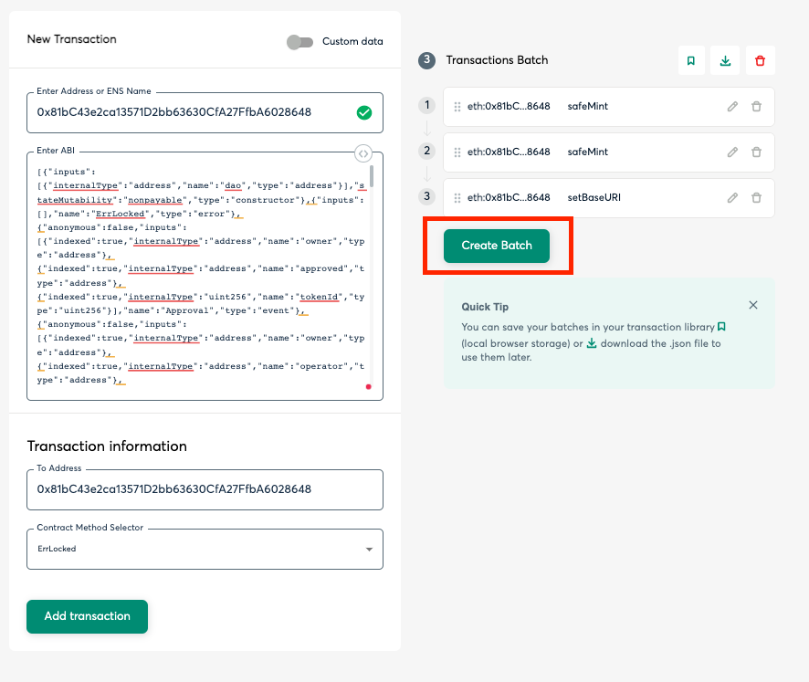

## How to Mint SBT by Gnosis Safe
1. After a profile PR merged.
2. Fetch `tuple(user_address, user_id)` info from [release.md](https://github.com/dcdao/profiles/blob/main/release.md)
```
0x2f2b799e8418d9D33C7fC8bD03a441E216cB6532,66bfdcf47c6448a7b0928e6f241d5a8e
0xa6B5EC845C8446A350a50bb58363c241ab7990b5,c6b2965dd9154de68b29c899552b4660
```
3. Fetch `metadataBaseURI` info from [release_ipfs.md](https://github.com/dcdao/profiles/blob/main/release_ipfs.md)
```
metadataBaseURI: ipfs://bafybeibgleulzcdyqpgycrnvc4flll7cte74rm4pdx4ydpor2jgvkyxg5y/
```
4. Init multisig transaction from [gnosis-safe](https://app.safe.global/transactions/history?id=multisig_0xc93c577D7C2c13A6E891b4a37F815102446882D8_0xe3b541441e95e64c57c07e28dacd171f65329d3ad463bf6a78aba60029048845&safe=eth:0x195741BC761B25A89fc7798087652f97f29B306a)

5. Click `New transaction` at left side of safe wallet and then click `Contract interaction`.


6. Enter `DarwiniaCommunityDaoSBT` [address](https://etherscan.io/address/0x81bC43e2ca13571D2bb63630CfA27FfbA6028648) and [ABI string](./abi/DarwiniaCommunityDaoSBT.abi).

7. Select `safeMint` in Contract Method Selector.

8. Fill `tuple(user_address, user_id)` in `to (address)` and `uri (string)` and then click `Add transaction`.
```
user_address -> to
user_id      -> uri
```
P.S If you have multi record. you could repeat step 7 and 8.


9. After fill all tuple record. Select `setBaseURI` in Contract Method Selector, enter `newBaseUri (string)`, and then click `Add transaction`.
```
metadataBaseURI -> newBaseUri
```


10. Click `Create Batch`.



11. Click `Simulate` and if it is `Success`, click `Send Batch` and then click `submit` to init the multisig transaction.


12. Notice and wait for other owner to `Confirm` the multisig transaction, after all required owners confirmed. the transaction will be executed. 
